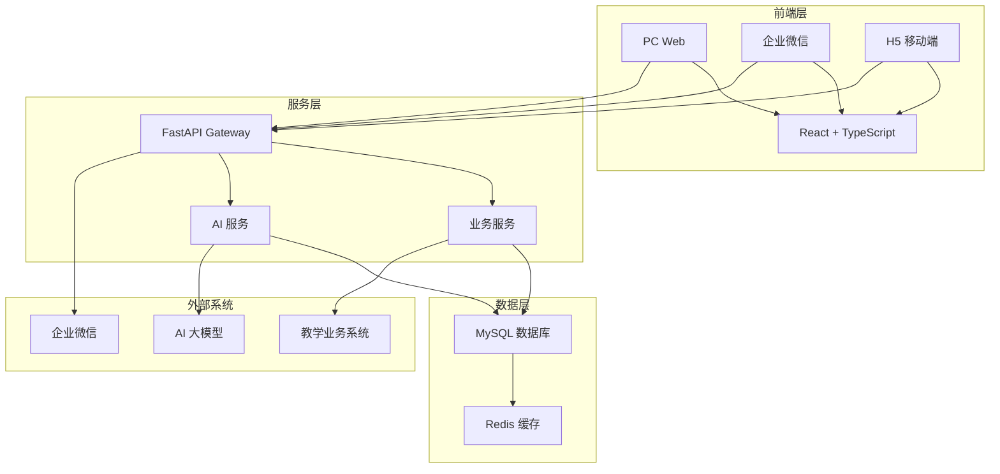

# 数科汇智平台 | SkyEdu Intelligence Hub Documentation

<p align="left">
  <a href="LICENSE"></a>
  
  
  
  
</p>

## 1. 文档目标

本文档是 **数科汇智平台（SkyEdu Intelligence Hub）** 的**项目总览文档**，为开发者、用户和管理者提供项目的**核心信息**和**快速入门指南**。

> **项目定位**：sky-edu-docs 作为**文档中心**，是各子项目之间的**中转和纽带**，统一管理分布式多仓库开发的文档体系  
> **平台定位**：数据驱动的教研与教学一体化平台  
> **Slogan**：数据汇流，智启教学  
> **适用范围**：项目开发者、技术团队、教育机构管理者  
> **创建日期**：2025-10-20  
> **最后更新**：2025-10-20  
> **版本号**：v1.0  
> **负责人**：项目团队

---

## 2. 项目背景与概述

### 2.1 现状痛点

当前教学业务系统在**事务性与流程化管理**方面功能完善，涵盖了排课、出勤、学生事务、教务流程等多个模块。然而，在**教学内容深度管理、知识沉淀与迭代**方面，其支持能力有限，具体体现在：

**教学内容管理痛点**：

- 📝 **知识资产协作管理缺失**：教案以 Word 文档形式分散存储，缺乏在线协同编写、版本控制和多级审核流程，阻碍教学经验的沉淀和知识复用
- 🔬 **课研成果管理不足**：课程研发工作的申报、推进、成果管理和知识库沉淀缺乏系统化支持，课研过程难以追踪，成果难以有效积累
- 📊 **教学质量提升闭环缺失**：听课记录、教学反馈、数据分析和改进建议缺乏系统化工具，难以形成教师教学能力持续提升的有效闭环
- 🛠️ **教学工具生态分散**：依赖第三方工具（如雨课堂）进行课堂互动，缺乏统一的教学辅助平台，工具间数据割裂
- 📋 **学习数据采集不足**：作业、练习、考试仍停留在纸质化管理，学习数据难以采集、分析，无法实现个性化学习支持

**学习体验痛点**（未来延展）：

- 📈 **学习轨迹数据缺失**：缺乏个人学习成长记录和知识掌握轨迹分析
- ⚡ **实时学习反馈不足**：无法即时了解学习状态和知识掌握情况
- 🎯 **个性化学习支持缺失**：缺乏基于学习数据的针对性练习和测试推荐

### 2.2 解决方案

数科汇智平台（SkyEdu Intelligence Hub）采用**数据中台架构**，以**教学知识资产全生命周期管理**为核心，提供：

1. **知识资产协作平台**：在线协同编写、版本控制、多级审核流程的教案管理系统
2. **课研工作流引擎**：申报、推进、跟踪、评估、成果沉淀的全流程课研管理
3. **教学质量提升体系**：听课记录、数据分析、改进建议的闭环式能力提升机制
4. **智能教学工具集成**：统一的教学辅助平台，集成点名、签到、互动、作业管理
5. **学习数据中台**：学生成长轨迹记录、个性化推荐的数据驱动学习支持

### 2.3 技术策略

- **前端离散化开发**：模块化架构设计，支持独立部署和集成到企业微信生态
- **数据中台化管理**：统一数据模型和 API 标准，支持多端应用和数据共享
- **递进式功能迭代**：围绕核心教学场景，采用敏捷开发模式逐步完善功能
- **分布式多仓库架构**：各子项目独立开发，通过文档中心统一协调

### 2.4 项目概述

数科汇智平台（SkyEdu Intelligence Hub）是一个以教学为核心的教育管理平台，专注于课程研发、教师能力提升和教、学、练、测、评等核心业务场景。平台采用现代化的技术架构，集成 AI 大模型能力，为教育机构提供智能化的教学管理解决方案。

### 2.5 目标用户

#### 👨‍🏫 教师（核心用户）

- **教案编写**：在线协作编写和迭代教案
- **课研管理**：申报、推进、跟踪课研项目
- **能力提升**：听课记录、教学改进、能力评估
- **教学工具**：统一的教学辅助工具平台

#### 👨‍💼 教学管理者

- **课程审核**：教案审核、课研项目审批
- **质量监控**：教学质量评估、教师能力分析
- **数据统计**：教学数据统计、效果分析

#### 👨‍🎓 学生（未来用户）

- **学习记录**：个人学习轨迹和成长记录
- **实时反馈**：学习状态实时反馈和预警
- **个性化学习**：针对性的练习和测试

## 3. 核心功能与技术架构

### 3.1 核心功能

#### 3.1.1 课程研发管理

- **课程设计**：支持课程大纲设计、教学目标制定、知识点体系构建
- **资源管理**：教学资源库管理、实验环境配置、案例库维护
- **版本控制**：课程迭代管理、变更追踪、质量评估体系
- **协作开发**：多人协作、评审流程、发布管理

#### 3.1.2 教师能力提升

- **能力评估**：多维度教学技能测评、专业能力分析
- **培训管理**：个性化培训计划、课程安排、效果跟踪
- **成长档案**：个人发展轨迹记录、成果展示
- **激励机制**：能力认证体系、晋升通道设计

#### 3.1.3 教学练测评

- **教学过程**：课堂管理、互动记录、实时反馈
- **练习系统**：智能题库管理、自动批改、个性化推荐
- **测评体系**：多维度评估、数据分析、报告生成
- **学习分析**：学习轨迹分析、效果评估、预警机制

### 3.2 系统架构



### 3.3 技术架构

#### 3.3.1 后端技术栈

- **框架**：FastAPI (Python 3.12+)
- **数据库**：MySQL + Redis
- **ORM**：SQLAlchemy + Alembic
- **认证**：JWT + OAuth 2.0
- **任务队列**：Celery
- **API 文档**：FastAPI 自动生成

#### 3.3.2 前端技术栈

- **框架**：React 19 + TypeScript
- **构建工具**：Vite
- **状态管理**：Zustand
- **UI 组件**：Ant Design
- **样式方案**：Tailwind CSS

#### 3.3.3 AI 集成

- **大模型**：通义千问 / 星火大模型
- **应用场景**：智能推荐、自动批改、学习分析

#### 3.3.4 系统集成

- **教学业务系统**：教学业务管理集成
- **企业微信**：即时通讯和身份认证
- **第三方系统**：北森、OA 等系统对接

### 3.4 项目结构

```ini
sky-edu-docs/                    # 文档中心
├── README.md                    # 项目总览
├── docs/                        # 文档目录
│   ├── shared/                  # 共享文档
│   │   ├── architecture/        # 整体架构设计
│   │   ├── requirements/        # 业务需求文档
│   │   ├── integration/         # 系统集成方案
│   │   └── standards/           # 开发规范标准
│   ├── projects/                # 项目文档
│   │   ├── sky-edu-backend/     # 后端服务文档
│   │   ├── sky-edu-frontend/    # 前端应用文档
│   │   ├── sky-edu-mobile/      # 移动端文档
│   │   └── sky-edu-ai/          # AI 服务文档
│   └── templates/               # 文档模板
└── resources/                   # 资源文件
```

### 3.5 开发原则

#### 3.5.1 敏捷开发

- 采用 Scrum 框架，2 周一个 Sprint
- 持续集成和持续部署
- 测试驱动开发（TDD）
- 快速迭代和反馈

#### 3.5.2 隐私保护

- 敏感信息使用环境变量管理
- 文档中使用占位符替代真实信息
- 定期审查公开内容
- 遵循 MIT 开源协议

#### 3.5.3 DevOps 规范

- 代码版本控制：Git + GitHub
- 自动化测试：单元测试 + 集成测试
- 监控告警：Prometheus + Grafana
- 容器化部署：Docker + Kubernetes

## 4. 快速开始

### 4.1 环境要求

- Python 3.12+
- Node.js 22+
- MySQL 8.0+
- Redis 6+

### 4.2 安装步骤

```bash
# 克隆文档中心
git clone https://github.com/idevebi/sky-edu-docs.git
cd sky-edu-docs

# 安装文档工具链
pnpm install

# 格式化文档
pnpm format

# 检查文档规范
pnpm lint
```

## 5. 核心要点

### 5.1 关键总结

1. **项目定位**：以**教学知识资产全生命周期管理**为核心的教育管理平台
2. **核心价值**：解决现有教学业务系统在**知识沉淀与迭代**方面的不足
3. **技术架构**：采用**数据中台架构**，支持前端离散化开发和递进式功能迭代
4. **目标用户**：以**教师为核心用户**，延展到教学管理者和学生
5. **开发原则**：敏捷开发 + 隐私保护 + DevOps 规范
6. **文档中心**：sky-edu-docs 作为各子项目的**中转和纽带**，统一管理分布式多仓库开发

### 5.2 实践建议

- 围绕核心教学场景，采用递进式开发模式
- 注重知识资产的协作管理和版本控制
- 建立数据驱动的教学质量提升体系
- 保持开源项目的隐私保护标准

## 6. 文档导航

### 6.1 共享文档

- [整体架构设计](./docs/shared/architecture/) - 系统整体架构和技术选型
- [业务需求文档](./docs/shared/requirements/) - 核心业务需求和用户故事
- [系统集成方案](./docs/shared/integration/) - 与现有系统的集成方案
- [开发规范标准](./docs/shared/standards/) - 统一的开发规范和代码标准

### 6.2 项目文档

- [后端服务文档](./docs/projects/sky-edu-backend/) - FastAPI 后端服务开发指南
- [前端应用文档](./docs/projects/sky-edu-frontend/) - React 前端应用开发指南
- [移动端文档](./docs/projects/sky-edu-mobile/) - H5 和移动端开发指南
- [AI 服务文档](./docs/projects/sky-edu-ai/) - AI 大模型集成和服务开发

### 6.3 文档模板

- [文档模板库](./templates/) - 统一的文档模板和规范

## 7. 许可证

本项目采用 [MIT License](LICENSE) 开源协议。
