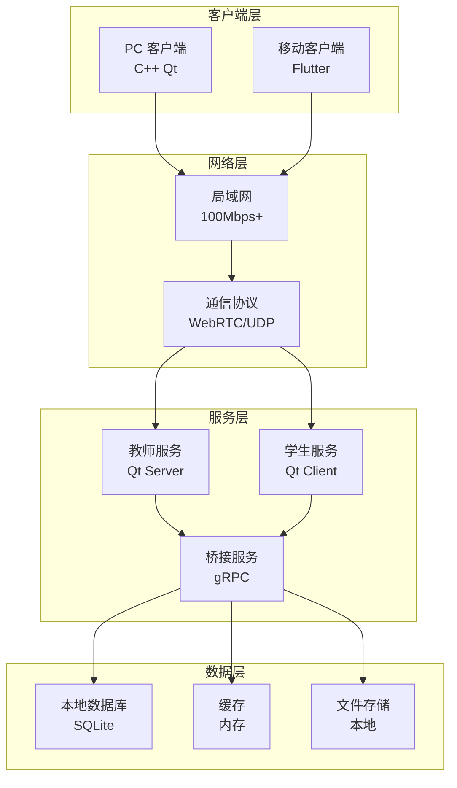
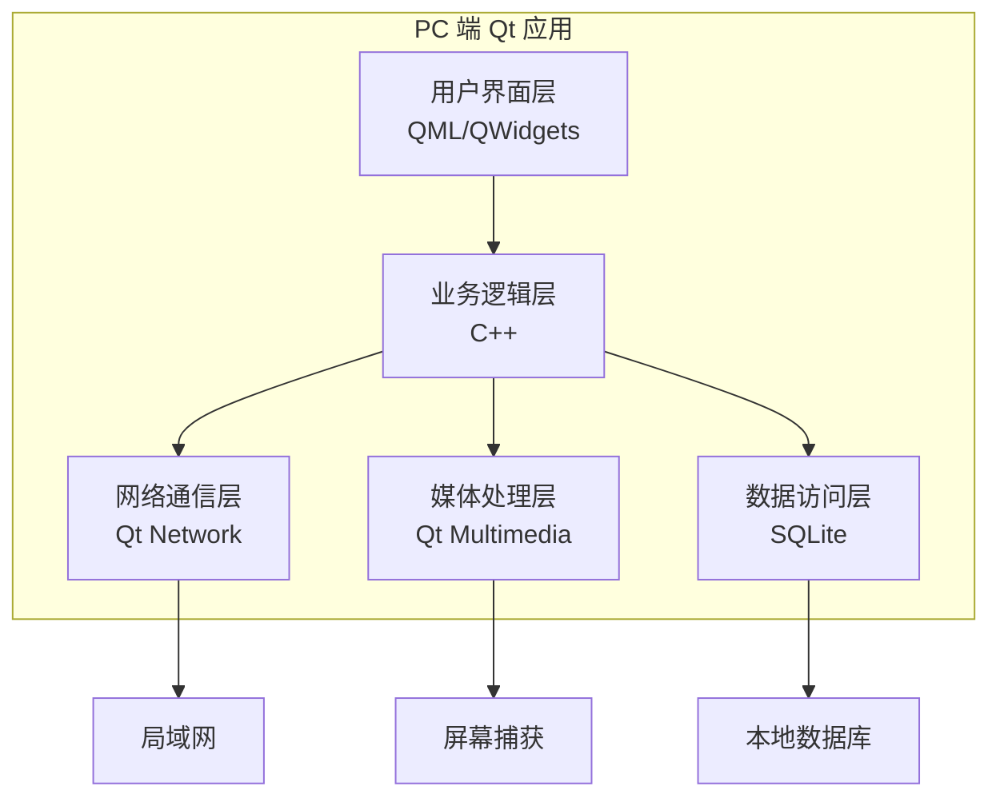
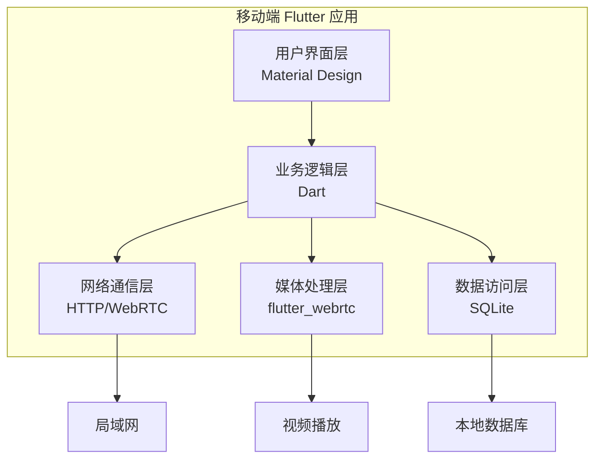
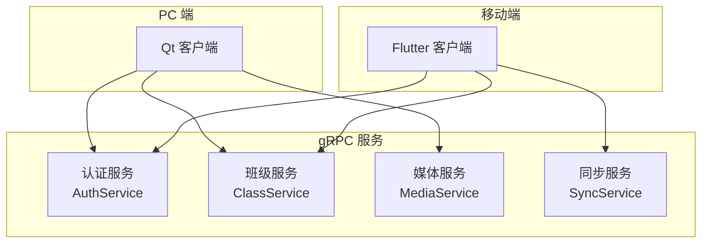
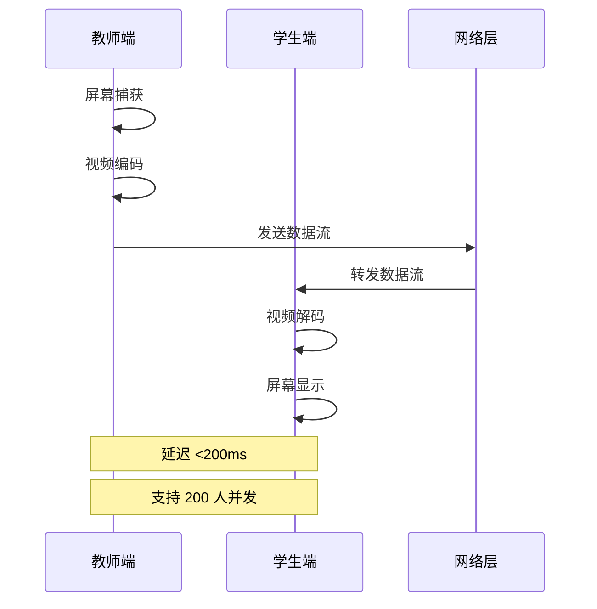
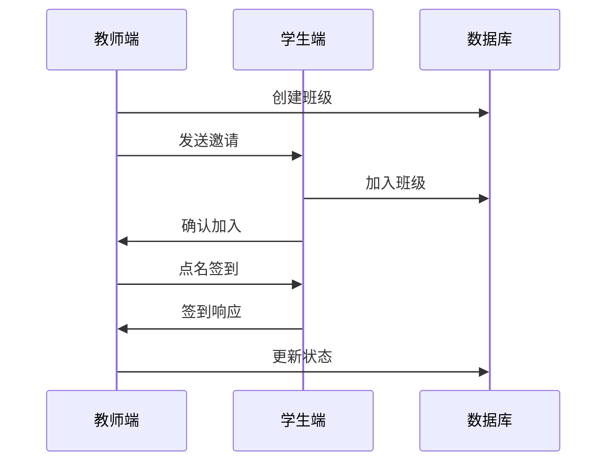
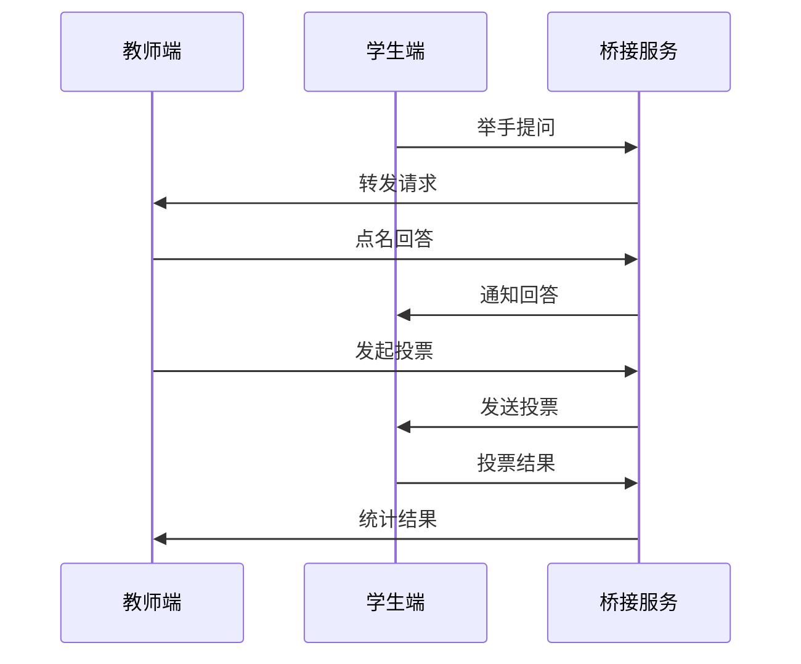
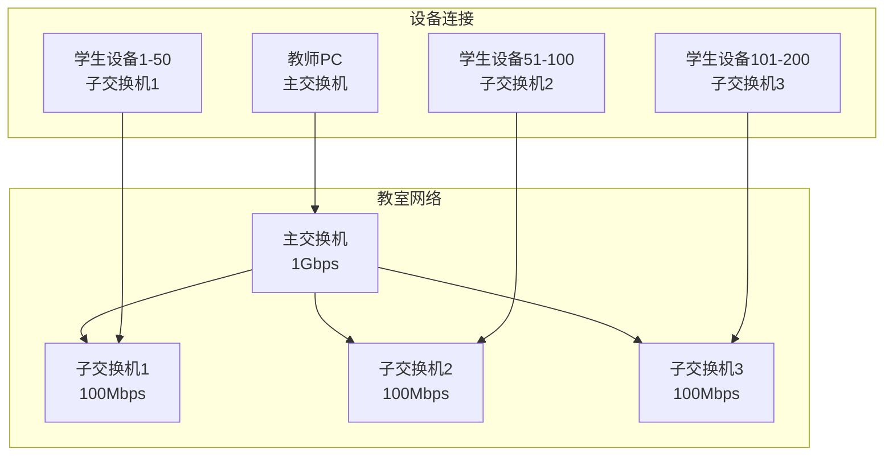

# 系统架构设计文档（SAD）

> 适用范围：技术架构师、开发团队、运维团队  
> 目标：设计课堂共屏软件的系统架构，确保技术栈实现可行性和系统可扩展性  
> 责任人：技术架构师  
> 首次创建：2025-10-21  
> 最近更新：2025-10-21  
> 版本：v1.0

## 1. 背景与目标

### 1.1 设计背景

基于产品需求文档和技术选型分析，设计支持 200 人并发的局域网课堂共屏软件系统架构。系统采用 C++ Qt + Flutter 混合技术栈，确保高性能和跨平台兼容性。

### 1.2 设计目标

- **性能目标**：支持 200 人并发，延迟 <200ms，CPU 占用 <50%
- **可靠性目标**：系统可用性 >99.5%，故障恢复时间 <5min
- **扩展性目标**：支持水平扩展，易于功能扩展
- **维护性目标**：代码结构清晰，易于维护和调试

### 1.3 设计原则

- **模块化设计**：各模块职责清晰，低耦合高内聚
- **分层架构**：采用分层架构，便于维护和扩展
- **性能优先**：优先考虑性能，确保用户体验
- **安全可靠**：内置安全机制，确保数据安全

## 2. 系统总体架构

### 2.1 架构概览



### 2.2 技术栈选择

#### 2.2.1 PC 端技术栈

- **开发框架**：C++ Qt 6.12+
- **网络通信**：Qt Network、WebRTC
- **数据库**：SQLite 3
- **视频处理**：FFmpeg、Qt Multimedia
- **构建工具**：CMake、qmake

#### 2.2.2 移动端技术栈

- **开发框架**：Flutter 3.22+
- **网络通信**：WebRTC、HTTP
- **数据库**：SQLite、SharedPreferences
- **视频处理**：flutter_webrtc
- **构建工具**：Flutter SDK

#### 2.2.3 桥接技术

- **通信协议**：gRPC + Protobuf
- **序列化**：Protocol Buffers
- **服务发现**：mDNS/Bonjour

## 3. 核心模块设计

### 3.1 PC 端架构

#### 3.1.1 模块划分



#### 3.1.2 核心组件

**屏幕共享组件**：

- **ScreenCapture**：屏幕捕获和编码
- **VideoEncoder**：视频编码（H.264/VP8）
- **NetworkSender**：网络数据发送
- **QualityController**：质量自适应控制

**课堂管理组件**：

- **ClassManager**：班级管理
- **UserManager**：用户管理
- **PermissionManager**：权限管理
- **SessionManager**：会话管理

**网络通信组件**：

- **TCPServer**：TCP 服务器
- **UDPBroadcaster**：UDP 广播
- **WebRTCManager**：WebRTC 管理
- **ConnectionPool**：连接池管理

### 3.2 移动端架构

#### 3.2.1 模块划分



#### 3.2.2 核心组件

**视频播放组件**：

- **VideoPlayer**：视频播放器
- **StreamDecoder**：流解码器
- **BufferManager**：缓冲区管理
- **QualityAdapter**：质量适配器

**互动功能组件**：

- **InteractionManager**：互动管理
- **QuestionManager**：问题管理
- **VoteManager**：投票管理
- **ChatManager**：聊天管理

**数据同步组件**：

- **DataSync**：数据同步
- **OfflineManager**：离线管理
- **CacheManager**：缓存管理

### 3.3 桥接服务架构

#### 3.3.1 gRPC 服务设计



#### 3.3.2 服务接口定义

**认证服务**：

```protobuf
service AuthService {
  rpc Login(LoginRequest) returns (LoginResponse);
  rpc Logout(LogoutRequest) returns (LogoutResponse);
  rpc RefreshToken(RefreshTokenRequest) returns (RefreshTokenResponse);
}
```

**班级服务**：

```protobuf
service ClassService {
  rpc CreateClass(CreateClassRequest) returns (CreateClassResponse);
  rpc JoinClass(JoinClassRequest) returns (JoinClassResponse);
  rpc GetClassInfo(GetClassInfoRequest) returns (GetClassInfoResponse);
}
```

**媒体服务**：

```protobuf
service MediaService {
  rpc StartScreenShare(StartScreenShareRequest) returns (StartScreenShareResponse);
  rpc StopScreenShare(StopScreenShareRequest) returns (StopScreenShareResponse);
  rpc GetStreamInfo(GetStreamInfoRequest) returns (GetStreamInfoResponse);
}
```

## 4. 数据流设计

### 4.1 屏幕共享数据流



### 4.2 课堂管理数据流



### 4.3 互动功能数据流



## 5. 网络架构设计

### 5.1 网络拓扑



### 5.2 通信协议

#### 5.2.1 协议选择

**主要协议**：

- **WebRTC**：实时音视频传输
- **UDP**：低延迟数据传输
- **TCP**：可靠数据传输
- **HTTP**：REST API 调用

**协议分层**：

```
应用层：业务逻辑
传输层：WebRTC/UDP/TCP
网络层：IP
数据链路层：以太网
物理层：网线/WiFi
```

#### 5.2.2 端口分配

- **WebRTC**：动态端口（UDP 10000-20000）
- **gRPC**：TCP 50051
- **HTTP API**：TCP 8080
- **mDNS**：UDP 5353

### 5.3 网络优化

#### 5.3.1 带宽管理

- **自适应码率**：根据网络状况调整视频质量
- **流量控制**：限制单用户带宽占用
- **优先级调度**：重要数据优先传输

#### 5.3.2 延迟优化

- **UDP 传输**：减少连接建立时间
- **本地缓存**：减少重复数据传输
- **并行处理**：多线程处理网络请求

## 6. 数据库设计

### 6.1 数据库架构

#### 6.1.1 数据库选择

- **主数据库**：SQLite 3（轻量级，适合本地部署）
- **缓存**：内存缓存（Redis 可选）
- **文件存储**：本地文件系统

#### 6.1.2 数据模型

**用户表（users）**：

```sql
CREATE TABLE users (
    id INTEGER PRIMARY KEY,
    username VARCHAR(50) UNIQUE NOT NULL,
    password_hash VARCHAR(255) NOT NULL,
    role VARCHAR(20) NOT NULL, -- teacher/student
    created_at TIMESTAMP DEFAULT CURRENT_TIMESTAMP
);
```

**班级表（classes）**：

```sql
CREATE TABLE classes (
    id INTEGER PRIMARY KEY,
    name VARCHAR(100) NOT NULL,
    teacher_id INTEGER NOT NULL,
    created_at TIMESTAMP DEFAULT CURRENT_TIMESTAMP,
    FOREIGN KEY (teacher_id) REFERENCES users(id)
);
```

**会话表（sessions）**：

```sql
CREATE TABLE sessions (
    id INTEGER PRIMARY KEY,
    class_id INTEGER NOT NULL,
    start_time TIMESTAMP NOT NULL,
    end_time TIMESTAMP,
    status VARCHAR(20) NOT NULL, -- active/ended
    FOREIGN KEY (class_id) REFERENCES classes(id)
);
```

### 6.2 数据同步策略

#### 6.2.1 同步机制

- **实时同步**：关键数据实时同步
- **批量同步**：非关键数据批量同步
- **冲突解决**：时间戳优先策略

#### 6.2.2 数据一致性

- **事务处理**：关键操作使用事务
- **数据校验**：定期校验数据完整性
- **备份恢复**：定期备份，支持快速恢复

## 7. 安全架构设计

### 7.1 安全策略

#### 7.1.1 认证授权

- **用户认证**：用户名/密码认证
- **会话管理**：JWT Token 管理
- **权限控制**：基于角色的访问控制（RBAC）

#### 7.1.2 数据安全

- **传输加密**：TLS 1.2+ 加密传输
- **存储加密**：敏感数据加密存储
- **访问控制**：细粒度权限控制

### 7.2 安全机制

#### 7.2.1 网络安全

- **防火墙**：支持常见防火墙配置
- **端口管理**：最小化开放端口
- **流量监控**：异常流量检测

#### 7.2.2 应用安全

- **输入验证**：所有输入数据验证
- **SQL 注入防护**：参数化查询
- **XSS 防护**：输出数据转义

## 8. 性能优化设计

### 8.1 性能目标

- **并发处理**：支持 200 人并发
- **响应时间**：延迟 <200ms
- **资源占用**：CPU <50%，内存 <200MB
- **吞吐量**：>1000 请求/秒

### 8.2 优化策略

#### 8.2.1 系统优化

- **多线程处理**：充分利用多核 CPU
- **内存管理**：优化内存分配和释放
- **I/O 优化**：异步 I/O 处理

#### 8.2.2 网络优化

- **连接池**：复用网络连接
- **数据压缩**：减少网络传输量
- **缓存策略**：减少重复请求

#### 8.2.3 算法优化

- **视频编码**：硬件加速编码
- **数据压缩**：高效压缩算法
- **负载均衡**：智能负载分配

## 9. 部署架构设计

### 9.1 部署模式

#### 9.1.1 单机部署

- **适用场景**：小型教室（<50 人）
- **部署方式**：单台服务器部署所有服务
- **资源要求**：CPU 4 核，内存 8GB

#### 9.1.2 分布式部署

- **适用场景**：大型教室（>100 人）
- **部署方式**：多台服务器分布式部署
- **资源要求**：CPU 8 核，内存 16GB

### 9.2 部署组件

#### 9.2.1 核心组件

- **教师服务**：Qt 服务器应用
- **学生服务**：Qt 客户端应用
- **桥接服务**：gRPC 服务
- **数据库服务**：SQLite 数据库

#### 9.2.2 辅助组件

- **监控服务**：系统监控
- **日志服务**：日志收集和分析
- **备份服务**：数据备份

## 10. 监控与运维

### 10.1 监控指标

#### 10.1.1 系统指标

- **CPU 使用率**：<50%
- **内存使用率**：<80%
- **磁盘使用率**：<90%
- **网络带宽**：<80%

#### 10.1.2 应用指标

- **响应时间**：<200ms
- **错误率**：<1%
- **并发数**：<200
- **吞吐量**：>1000 req/s

### 10.2 运维策略

#### 10.2.1 自动化运维

- **自动部署**：CI/CD 自动化部署
- **自动监控**：实时监控和告警
- **自动恢复**：故障自动恢复

#### 10.2.2 故障处理

- **故障检测**：实时故障检测
- **故障定位**：快速故障定位
- **故障恢复**：快速故障恢复

## 11. 扩展性设计

### 11.1 水平扩展

#### 11.1.1 服务扩展

- **负载均衡**：多实例负载均衡
- **服务发现**：自动服务发现
- **数据分片**：数据水平分片

#### 11.1.2 存储扩展

- **数据库集群**：数据库集群部署
- **缓存集群**：缓存集群部署
- **文件存储**：分布式文件存储

### 11.2 功能扩展

#### 11.2.1 模块化设计

- **插件架构**：支持插件扩展
- **API 接口**：标准化 API 接口
- **配置管理**：灵活配置管理

#### 11.2.2 版本管理

- **向后兼容**：保持向后兼容
- **平滑升级**：支持平滑升级
- **回滚机制**：支持快速回滚

## 12. 验收与度量

### 12.1 架构验收

- **性能达标**：满足所有性能指标
- **功能完整**：实现所有设计功能
- **安全可靠**：通过安全测试
- **可维护性**：代码结构清晰

### 12.2 度量指标

- **代码覆盖率**：>80%
- **性能测试**：通过压力测试
- **安全测试**：通过安全审计
- **文档完整性**：技术文档完整

## 13. 相关文档

- [产品需求文档](./002_product-requirements_产品需求文档.md)
- [市场调研与技术选型分析](./001_market-research_市场调研与技术选型分析.md)
- [C++ Qt + Flutter 混合技术栈评估](./research/009_cpp-qt-flutter-evaluation_C++ Qt + Flutter 混合技术栈评估.md)
- [200人并发场景负荷预测分析](./research/010_concurrent-load-analysis_200人并发场景负荷预测分析.md)

## 14. 自检清单

- [ ] 单一主题且标题准确
- [ ] 读者与适用场景明确
- [ ] 关键结论清晰、可执行
- [ ] 步骤/接口/示例齐全
- [ ] 指向相关文档的链接有效
- [ ] 元信息与更新时间已填写
